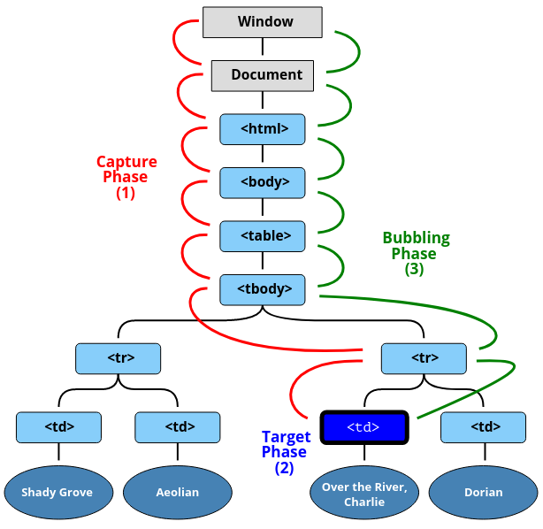

# Callbacks

Eine sog. Callback Funktion ist eine Funktion die einer äußeren Funktion als Parameter übergeben und innerhalb der äußeren Funktion aufgerufen wird.

Dazu ein kleines Beispiel:
```JavaScript
function outerFunction(callback) {
    let string = callback('Jack');
    console.log(string);
}

function innerFunction(name) {
    return `Nice to meet you ${name}.`;
}

outerFunction(innerFunction); // Nice to meet you Jack.
```
Beachtet, dass man zwar beliebig viele Callback-Funktionen ineinander verschachteln kann, jedoch der Programmcode dadurch unübersichtlich und unleserlich wird.

In diesem Zusammenhang gibt es den Begriff der [Callback Hell/ Pyramid of Doom](https://www.freecodecamp.org/news/how-to-deal-with-nested-callbacks-and-avoid-callback-hell-1bc8dc4a2012/) und Möglichkeiten wie man diese 'Hölle' umgehen kann.

<br>

**Kleiner Exkurs zu SOLID-Prinzipien**

Allgemein ist es immer sinnvoll seine Funktionen so klein und einfach zu halten wie es möglich ist - gem. dem *Single Responibility Principle* aus den `SOLID`-Prinzipien.

Beim Programmieren ist es ebenfalls zu empfehlen sich an die Vorgaben/ Erkenntnisse von `Clean Code` (Robert C. Martin) und `pragmatic Programming` (Andy Hunt, Dave Thomas) zu halten.

Dabei sollten 'einfache' Ansätze wie z. B. bei der Wahl der Namen von Funktionen und Variablen sowie das `Single Responsibility Principle` sofort umgesetzt werden.
Damit spart man sich nicht nur unnötige Kommentare, die bei der Veränderung der Codebase meist nicht aktuallisiert werden, sondern der Code ist wesentlich lesbarer.

Beispiel:

```JavaScript
// Bad
let hp = {
    name : "Harry",
    name2: "Potter",
    age: 50,
    plz: 36037,
    place: "Fulda"
}

function person() {
    Object.keys(hp).forEach((k) => {
    	const v = hp[k];
      console.log(k, v);
    });
}

person();

// Better
let objectOfHarryPotter = {
    lastName: "Potter",
    firstName: "Harry",
    age: 50,
    postalCode: 36037,
    place: "Fulda"
}

function printKeyValuePairsOfObject(object) {
    Object.entries(object).forEach(([keyOfObject, valueOfObject]) => {
    	console.log(keyOfObject, valueOfObject);
    });
}

printKeyValuePairsOfObject(objectOfHarryPotter);
```

<br>

**Links:**

- MDN Resource: [Callbacks (short)](https://developer.mozilla.org/en-US/docs/Glossary/Callback_function)
- JavaScriptInfo: [Callbacks (verbose)](https://javascript.info/callbacks)
- DigitalOcean: [SOLID Principles](https://www.digitalocean.com/community/conceptual_articles/s-o-l-i-d-the-first-five-principles-of-object-oriented-design)
- Medium: [Clean Code - Writing Functions or Methods](https://medium.com/swlh/clean-code-writing-functions-or-methods-4e6e53ff4ac2)
- Refactoring Guru: [Refactoring Techniques](https://refactoring.guru/refactoring/techniques)
- Youtube: [Seven Ineffective Habits of Programmers - Kevin Henney](https://www.youtube.com/watch?v=ZsHMHukIlJY&t=1395s)

<br>

# Promise

Neben der Möglichkeit Asynchronität mit Callbacks und setTimeout umzusetzen gibt es sog. Promises.

Ein Promise repräsentiert dabei zunächst einen eventuellen Zustand einer asynchronen Operation und dessen Ergebnisses.

Die Zustände, die eine Promise einnehmen kann sind:

    - pending:      initialier Zustand (weder fulfilled noch rejected)
    - fulfilled:    Operation wurde erfolgreich abgeschlossen
    - rejected:     Operation ist fehlgeschlagen

In der folgenden Übersicht sind neben den Zuständen von der Promise-Instanz auch die Funktions-Argumente `resolve` und `reject` ersichtlich.

<figure>
    
    <figcaption>
        Zustände von einer Promise
    </figcaption>
</figure>

Beim Erreich von einem Zustand (entweder `fulfilled` oder `rejected`) werden die jeweiligen Handler `.then` (*state: fulfilled*) oder `.catch` (*state: rejected*) aufgerufen.

Dabei geben die Handler jeweils ein Promise zurück und können sogar verkettet werden, d.h. das Ergebnis eines `.then` kann der nächsten `.then` übergeben werden, solange die vorhergehende Promise aufgelöst (resolved) werden kann.

Wenn eine Promise nicht aufgelöst werden kann und der Zustand `rejected` erreicht wird, wird der `.catch` Handler ausgeführt.

Dieses Verhalten ähnelt dem vom `try...catch`-Block, das für die flow-control für Errors eingesetzt wird.

In der folgenden Übersicht wird das sog. Promise-chaining gezeigt:

<figure>
    
    <figcaption>
        Verkettung von Promises (promise chaining)
    </figcaption>
</figure>

Als Beispiel für das Promise-chaining wird ein String sukzessiv nach dem erfolgreichem Resolve mit `return` in der Kette weitergegeben.


**Bsp.:**

```JavaScript
let promise = new Promise((resolveFunction, rejectFunction) => {
	setTimeout(() => {
        resolveFunction(); // call the function cain below
  }, 2000);
});

promise
    .then(result => {return 'Never'})
    .then(result => {return result + ' gonna give you up'})
    .then(result => {return result + ' never gonna let you down'})
    .then(result => {console.log(result)})
    .catch(err => {console.error(err)});
    // Successful output: Never gonna give you up never gonna let you down
```

Hierbei sollte beachten werden, dass der Aufruf von `setTimeout` nach der Initialisierung der Promise ausgeführt wird und die Kette durch den Aufruf von der `resolveFunction` in Gang gesetz wird.

Ohne den Aufruf `resolveFunktion()` würde kein Funktionsaufruf erfolgen, womit die untere Kette nicht ausgeführt wird.

Mit Hilfe des Promise-Chaining ist der Programm-Code wesentlich leserlicher als mit verschachtelten Callbacks für eine asynchrone Behandlung von Funktionen.

Ein weiteres Beispiel zeigt auf, wie man bewusst einen Error *throw* im `.catch`
fangen und behandeln kann.

Dabei bedienen wir uns zum Aufruf der `rejectFunction`, die den Zustand `rejected` eines Promises darstellt.

**Bsp.:**
```JavaScript
let promise = new Promise((resolveFunction, rejectFunction) => {
	setTimeout(() => rejectFunction(new Error('Catch me if you can!')), 1000);
});

promise.catch((err) => {
	console.log(err.message); // Catch me if you can!
});
```


<br>

**Links:**

- MDN Resource: [Concurrency Model and the event loop](https://developer.mozilla.org/en-US/docs/Web/JavaScript/EventLoop)

- MDN Resource: [Promise](https://developer.mozilla.org/en-US/docs/Web/JavaScript/Reference/Global_Objects/Promise)


- JavaScriptInfo: [Promise Basics](https://javascript.info/promise-basics)

<br>

# Async Functions (ES2017)

Mit Einführung von Async-Functions und ihrer Syntax `async/ await` gibt es eine einfache Möglichkeit mit Promises umzugehen und asynchronen Programmcode zu schreiben.

Die Einfachheit dieser Notation ähnelt an das Schreiben von synchronen Funktionen und ist deshalb schnell und intuitiv einsetzbar.

<figure>
    
    <figcaption>Next Level Async-Function Meme</figcaption>
</figure>

Aus diesem Grund empfehle ich für die allgemeine Lesbarkeit die mit ES2017 Standard eingeführten Async-Functions zu nutzen.

Async-Function werden mit dem Schlüsselwort `async` deklariert und innerhalb dieser Funktionen kann nur das Schlüsselwort `await` für ein promise-basiertes Verhalten genutzt werden.

**Bsp.:**

```JavaScript
async function sayHelloWorld() {
    let helloStr = await getHelloString();
    let worldStr = await getWorldString();
  
    console.log(`${helloStr} ${worldStr}`);
}

async function getHelloString() {
	return 'Hello';
}

async function getWorldString() {
	return 'World';
}

sayHelloWorld(); // Hello World
```

Hierbei ist zu beachten, dass `async function` eine Promise bzw. den Wert einer Promise zurück gibt und nur das Schlüsselwort `await` auf eine Promise warten kann.

Darüber hinaus gibt es in diesem Beispiel ein kleines Problem mit Asynchronität innerhalb der `sayHelloWorld()` Funktion.

Denn innerhalb der `sayHelloWorld()` Funktion wird zunächst auf die Rückgabe von der Promise für die Funktion `getHelloString()` gewartet bevor die Funktion `getWorldString()` ausgeführt wird.

Damit diese Aufrufe nicht **nacheinander** ausgeführt werden, packen wir sie in einer Promise, die uns ermöglicht diese Aufrufe **parallel** auszuführen.

Dabei bedienen wir uns der `Promise.all()` Methode und geben ein Array von Promises als Argument.

Mit der destrukturierende Zuweisung (*destructuring assignment*) können wir die Ergebnisse aus dem Array von Promises unseren Variablen, wie es oben der Fall ist, zuweisen.

**Bsp.:**

```JavaScript
async function sayHelloWorld() {
    let [
        helloStr, 
        worldStr
        ] = await Promise.all([
            getHelloString(), 
            getWorldString()
        ]);
  
    console.log(`${helloStr} ${worldStr}`);
}

async function getHelloString() {
	return 'Hello';
}

async function getWorldString() {
	return 'World';
}

sayHelloWorld(); // Hello World
```


<br>

**Links:**

- MDN Resource: [Introduction to asynchronous JavaScript](https://developer.mozilla.org/en-US/docs/Learn/JavaScript/Asynchronous/Introducing)

- MDN Resource: [Async function](https://developer.mozilla.org/en-US/docs/Web/JavaScript/Reference/Statements/async_function)

- JavaScriptInfo: [Async/Await](https://javascript.info/async-await)

- Youtube: [JSConf Asynchrony Under the Hood](https://www.youtube.com/watch?v=SrNQS8J67zc)

<br>

# addEventListener

Die `addEventListener` Funktion wird immer dann aufgerufen, wenn das jeweilige Event, das als erstes Parameter
der `addEventListener` Funktion übergeben wurde, getätigt wird.

Die **Signatur** der `addEventListener` Funktion sieht folgendermaßen aus:

```JavaScript
target.addEventListener(type, listener);
target.addEventListener(type, listener, options);
target.addEventListener(type, listener, useCapture);
```

Dabei stellt der Parameter `type` ein *Event* als String dar auf dem
das Programm 'hört'.

Der Parameter `listener` stellt eine sog. **Callback** Funktion dar, die beim
eintreten des *Events* ausgeführt wird.

Darüber hinaus gibt es weitere Parameter wie `options`, mit der es möglich ist dem EventListener weitere Charakteristika beizufügen.

Im Ausdruck `addEventListener(type, listener, false)` steht das `false` für
den dritten Parameter `useCapture`.

Dabei wird das Verhalten bei der Bubbling & Capture Phase eines Events modifiziert, d. h. ob wir zuerst die Events der Kindelemente abhandeln wollen oder die Events der Elternelemente.

- `addEventListener(type, listener, false)` -> (default) Capturing auf Bubblingphase gesetzt
- `addEventListener(type, listener, true)` -> Capturing auf CapturePhase gesetzt

Die Phasen sind in diesem Schaubild ersichtlich:

<figure>
    
    <figcaption>
        3 Phasen - Capture, Target, Bubbling
    </figcaption>
</figure>


**Links:**

- MDN Resource: [addEventListener](https://developer.mozilla.org/en-US/docs/Web/API/EventTarget/addEventListener)
- MDN Resource: [Event reference](https://developer.mozilla.org/en-US/docs/Web/Events)
- MDN Resource: [Interfaces based on Event](https://developer.mozilla.org/en-US/docs/Web/API/Event#introduction)
- JavaScriptInfo: [Bubbling and Capture](https://javascript.info/bubbling-and-capturing)