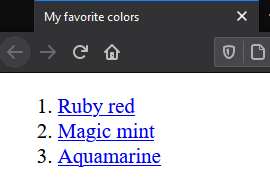

# My favorite colors

Edit the given `index.html` to let it look similar to this:

1. The list is now sorted in descending order by favorite color.

2. The entries in the list link to the Wikipedia page of the color:
   - Ruby red: [https://en.wikipedia.org/wiki/Ruby_(color)#Ruby_red](https://en.wikipedia.org/wiki/Ruby_(color)#Ruby_red)
   - Magic mint: [https://en.wikipedia.org/wiki/Spring_green#Magic_mint](https://en.wikipedia.org/wiki/Spring_green#Magic_mint)
   - Aquamarine: [https://en.wikipedia.org/wiki/Aquamarine_(color)](https://en.wikipedia.org/wiki/Aquamarine_(color))

3. The title has changed to `My favorite colors`.