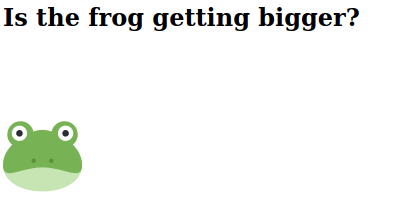

# Let a frog explode with a key event

This time we want to inflate this brave frog "🐸" until this "💥" happens.

To be able to pull this off, you need to work with event listeners and in this case you need the "keydown" event and a function to adjust the size of the green fellow above.

The frog should get bigger as you press the &#8593; arrow up key and should shrink if you press the &#8595; arrow down key.

It is up to you to decide which size the green one can reach until it explodes.

After the explosion you should remove the event-listener and in the process you should prevent the default scrolling in the browser.

 

#### Example

<figure>
    
    <figcaption>the frog is getting bigger as you press the &#8593; arrow key</figcaption>
</figure>

 

<figure>
    
    <figcaption>at some point it should explode</figcaption>
</figure>

 

**Tips:**

- addEventListener("keydown", handlerFunction)
- removeEventListener("keydown", handlerFunction)
- preventDefault()
- element.style.fontSize
- keys to check "ArrowUp", "ArrowDown"