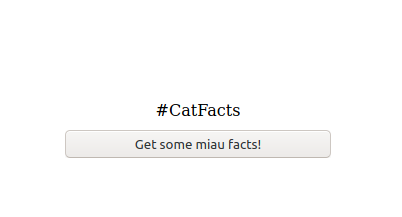

# Fetch me some cat facts

In this exercise I want you to use the fetch API to get
some interessting cat facts with a click on a button.

To get some facts we are going to use a public and free
API.

Here is the [github page](https://github.com/alexwohlbruck/cat-facts) for your interest.

But do not panic! There is a good documentation how you can make
use of it.

You can find the documentaion on this [page](https://alexwohlbruck.github.io/cat-facts/docs/).

As we are going to fetch some facts we have to use the specific [endpoint](https://alexwohlbruck.github.io/cat-facts/docs/endpoints/facts.html) for it. 

There is an example how the response is structured so you are able to process it.

 

**Tipps:**

- fetch API
  - [MDN resource](https://developer.mozilla.org/en-US/docs/Web/API/Fetch_API/Using_Fetch)
  - [JS Tutorial Fetch API](https://www.javascripttutorial.net/javascript-fetch-api/)
- addEventListener
- getElementById
- innerText
- try and catch
- JSON.parse()
- async function -> [MDN resource](https://developer.mozilla.org/en-US/docs/Web/JavaScript/Reference/Statements/async_function)

 

## How it should look like

**Before click-event**

<figure>
    
    <figcaption>Nothing is triggered, yet!</figcaption>
</figure>

 

**After we click on the button**

<figure>
    
    <figcaption>Sounds very interesting, am I right?</figcaption>
</figure>